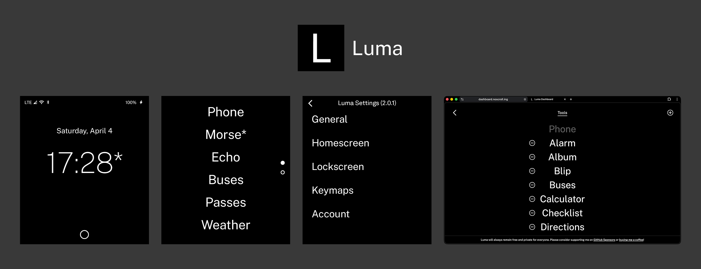

A minimal launcher for the Light Phone III.

> [!NOTE]
> This is the pre-release version of Luma. It is currently under development.
> It is not intended to be used daily as there may be many bugs!

## Installation
The lastest .apk file is available in [releases](https://github.com/vandamd/luma/releases/latest).

## Getting Started
For Luma to work, you are prompted to grant various permissions during onboarding. These permissions allow Luma to display it's custom lockscreen, detect key presses, display notifications, change the brightness, install apps and more!

To avoid conflicts, the use of other keymapping apps is discouraged (e.g. Key Mapper).

It is expected that LightOS remains the default Phone, Home and SMS app, otherwise LightOS will crash.

## Features
- Configurable tools via a web dashboard, ([dashboard.noscroll.ing](https://dashboard.noscroll.ing))
- Fingerprint compatible lock screen (pattern password currently only supported)
- Key mapping (camera and scroll wheel)
- Gestures
- Colour filter toggler

## Acknowledgements
Huge thank you to the following projects:
- Forked from: [OlauncherCF](https://github.com/OlauncherCF/OlauncherCF)
- Inspired by: [InkOS](https://github.com/gezimos/inkOS)

## Support
Luma is developed and maintained in my free time.

If you find it useful, please [consider sponsoring](https://github.com/sponsors/vandamd)! :)
